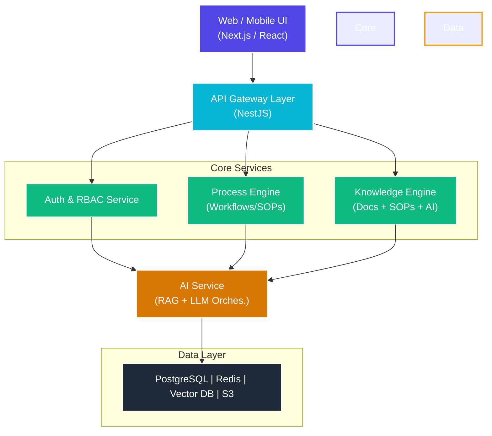

# Technical Architecture & Topology

ProcessJR is built as a highly decoupled, service-oriented platform designed to scale independently, resist offline network gaps, and allow frontend and backend teams to build concurrently without blocking dependencies.

---

## System Topology

---

## Core Technology Stack

| Layer | Recommended Technology | Description |
| :--- | :--- | :--- |
| **Frontend UI** | **Next.js & React** | Unified interface serving desktop, tablet, and mobile browsers with fully responsive layouts. |
| **Edge Resilience** | **PWA Capabilities** | Service Workers, IndexedDB, and Cache API for offline vectors, query caches, and local background synchronization. |
| **Core Gateway** | **NestJS (Node.js)** | API gateway, routing, RBAC gatekeeping, rate-limiting, CORS, and centralized audit logging. |
| **AI Backend** | **FastAPI (Python)** | High-performance Python endpoint orchestrating vector searches, semantic parsing, and RAG pipelines. |
| **Relational DB** | **PostgreSQL** | Standardized relational model holding workspace states, users, revision histories, and logs. |
| **AI Memory** | **PostgreSQL + `pgvector`** | Integrated high-speed vector storage for SOP embeddings and semantic retrieval. |
| **Caching / Queues** | **Redis** | In-memory key-value cache and background worker queue for heavy media transcriptions. |
| **Object Storage** | **AWS S3 / Supabase** | Scalable storage holding unstructured raw manuals, blueprints, photos, and voice notes. |
| **SSO & RBAC** | **SAML 2.0 / Okta / Azure AD** | Active Directory synchronization to automate enterprise floor-level access permissions. |

---

## Decoupled Development & Integration Strategy

To maximize engineering speed and allow the frontend (Web/PWA) and backend (APIs) teams to build, test, and deploy completely independently, ProcessJR adopts a **strict API-First architecture**.

### 1. Decoupled Repositories & Independent Deployments

* **Frontend Repository (`/apps/web`)**: 
  - Independent static/SPA React/Next.js application.
  - Deployed directly to modern static web hosts (e.g., Vercel, Netlify, or AWS S3/CloudFront) with zero server-side Node.js dependencies.
  - Communicates with backend endpoints purely through standardized, encrypted HTTPS and WebSockets.
* **Backend Services Repository (`/apps/backend`)**:
  - Contains the NestJS API Gateway and the Python AI services.
  - Deployed inside containers (Docker/Kubernetes) to cloud clusters (e.g., AWS ECS, GCP Cloud Run) independently of the frontend code changes.

### 2. API-First Contract (OpenAPI/Swagger)

* **Single Source of Truth**: The API contract is defined using the **OpenAPI 3.0 Specification** (stored as `openapi.yaml` in a shared location).
* **Auto-Generated Typings**: 
  - Using `openapi-typescript`, the frontend automatically generates TypeScript interfaces from the `openapi.yaml` contract.
  - This guarantees that both frontend and backend stay perfectly type-synchronized, preventing runtime API mismatches (contract drift).

### 3. Parallel Development & Mocking (Mock Service Worker - MSW)

* **Frictionless Mocking**: The frontend team uses **Mock Service Worker (MSW)** or **Prism** to intercept network calls at the browser level.
* **Instant Client-Side Development**: 
  - Even before the backend team has written database schemas or server code for a new feature (e.g., Conflict Resolution endpoints), the frontend team can build fully functional UI screens using mock data that strictly adheres to the OpenAPI contract.
  - When the backend APIs are ready, the frontend team simply switches off the MSW mock layer, pointing the client to the real staging API Gateway.

### 4. End-to-End API Security & CORS

* **Security Gatekeeping**: The NestJS API Gateway acts as the sole public access point, handling CORS policies, rate limiting, and JWT/SSO token verification.
* **Microservice Isolation**: Python AI services and vector databases are isolated within a private virtual cloud network (VPC) and are completely unreachable from the public internet. They only communicate securely behind the NestJS gateway.
