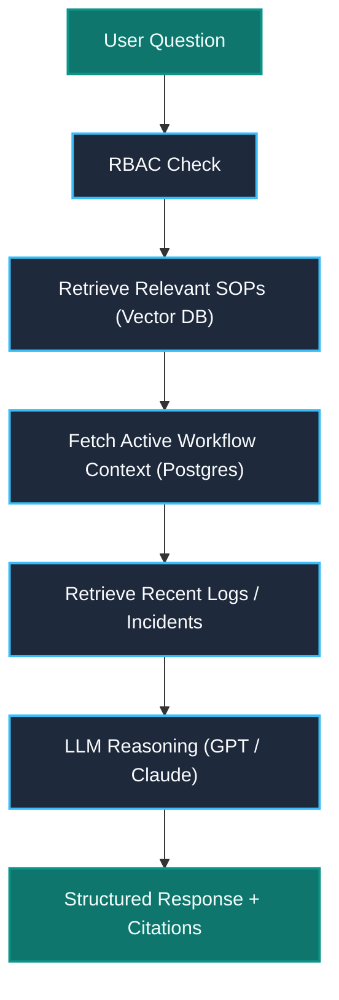
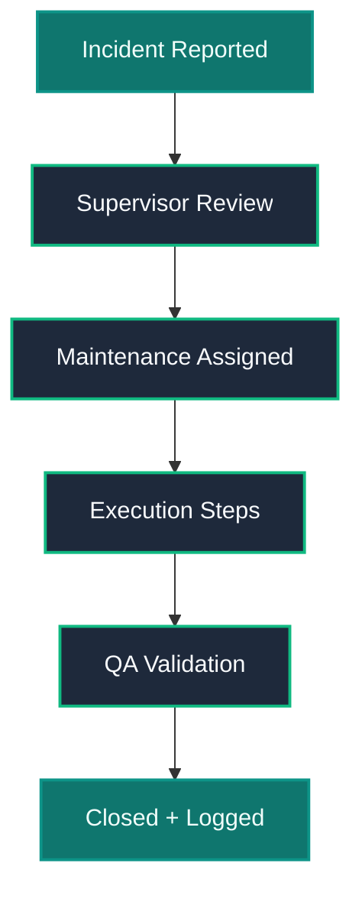

# Operational Workflows & Long-Term Roadmap

This section outlines the internal lifecycles of AI requests, real-world incident response workflows, and the future integration roadmap for the ProcessJR platform.

---

## AI Request Flow

When a floor operator asks a question, ProcessJR executes a highly secured, context-rich retrieval and reasoning pipeline before delivering a response:

---

## Example Incident Workflow

Below is the state-machine sequence for an active floor incident resolved with the assistance of ProcessJR:

---

## Long-Term Vision

ProcessJR is designed to evolve into **Operational AI Infrastructure** and a **Digital Workforce Memory** that transforms how industrial companies manage workforce capabilities.

### Future Integrations

* **Enterprise Systems**: Direct database integrations with **SAP**, **ERP systems**, and **Manufacturing Execution Systems (MES)**.
* **Industrial IoT & Telemetry**: Direct event listeners on PLC telemetry, predictive maintenance metrics, and machine digital twins.
* **Workflow Orchestration**: Autonomous scheduling of maintenance jobs and spare parts ordering based on historical diagnostics logs.

---

## Future Possibilities Roadmap

* **Dedicated Native Companion Apps**: High-fidelity native iOS and Android apps (React Native/Flutter) optimized for device-level thermal imaging camera APIs and hardware barcode scanners.
* **Smart Glasses Integration**: Real-time Heads-Up Display (HUD) safety SOP overlays (e.g., Apple Vision Pro, RealWear, Google Glass Enterprise).
* **Live Visual Support**: Instant remote engineer video feeds with augmented-reality markup overlay capabilities.
* **Edge & Private Deployment**: Fully isolated private network deployments running on local factory servers (Edge AI) for zero-internet facilities.
* **AI-Assisted Maintenance Planning**: Intelligent scheduling that predicts part failures based on operator conversation volumes.
